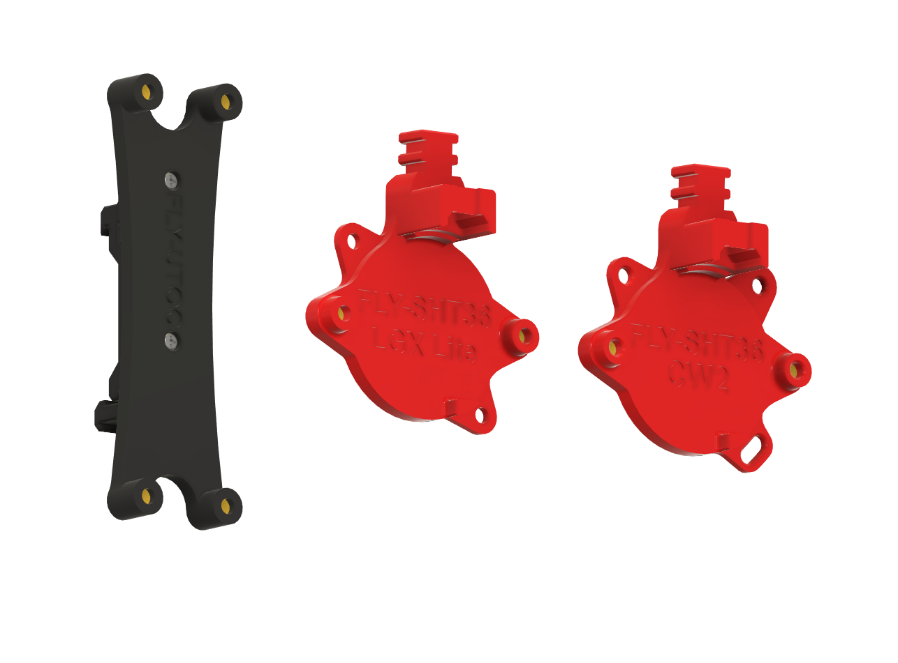

# FLY-SHT36_Mounts
A collection of extruder mounts for the [Mellow FLY-SHT36](https://github.com/Mellow-3D/Klipper-CAN-Toolboards) CAN bus toolhead board.

## What to Print

### Bondtech LGX Lite

 - 1x [FLY-SHT36_LGX-Lite.stl](STL/FLY-SHT36_LGX-Lite.stl)
 - 2x [Spacer.stl](STL/Spacer.stl) 
 

 ### Voron Clockwork 2 
 
 - 1x [FLY-SHT36_CW2.stl](STL/FLY-SHT36_CW2.stl)
 - 1x [Long_Spacer.stl](STL/Long_Spacer.stl)
 - 2x [Spacer.stl](STL/Spacer.stl) 

As an alternative to the spacers, you may use M3 nylon or brass standoffs.

### UTOC Mount

If you are using FLY-UTOC-1 or FLY-UTOC-3 You should also print:
 - 1x [FLY-UTOC.stl](STL/FLY-UTOC.stl)
 - 1x [PCB_DIN_Clip.stl](STL/PCB_DIN_Clip.stl) (If mounting to DIN Rails)

 
## Recommended print settings:

 - No Supports
 - 4 Perimeters
 - 5 Solid top & bottom layers
 - 40% Infill
 - 0.2 Layer height

## Remove the built-in support bridge

# Installation

